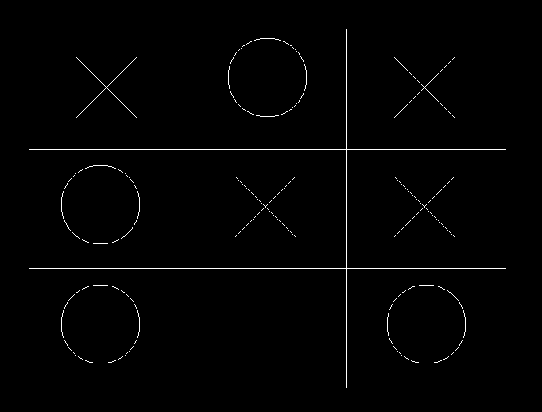

# Morpion
Un Morpion en langage C utilisant la bibliothèque SDL.
Cc618 aka Célian m'a conseillé de faire un morpion en C pour pouvoir m'entrainer en C vu que c'est un langage que je vais beaucoup manipuler au sein de mes études. Au début, je ne pensais même pas que je pourrais le faire mais finalement, je suis arrivé à manipuler le C, utiliser un nouveau IDE, comprendre le GCC, et manipuler une librairie ce qui sont des nouveautés pour moi. Evidemment, le script est très loin d'être parfait mais a le mérite de fonctionner, par la suite je l'optimiserai et le simplifierai. Pour que ce soit plus plaisant qu'une simple console j'ai utilisé la libraire SDL de base pour afficher le jeu. Le jeu ne dispose pas encore d'IA mais je compte les ajouter par la suite.

